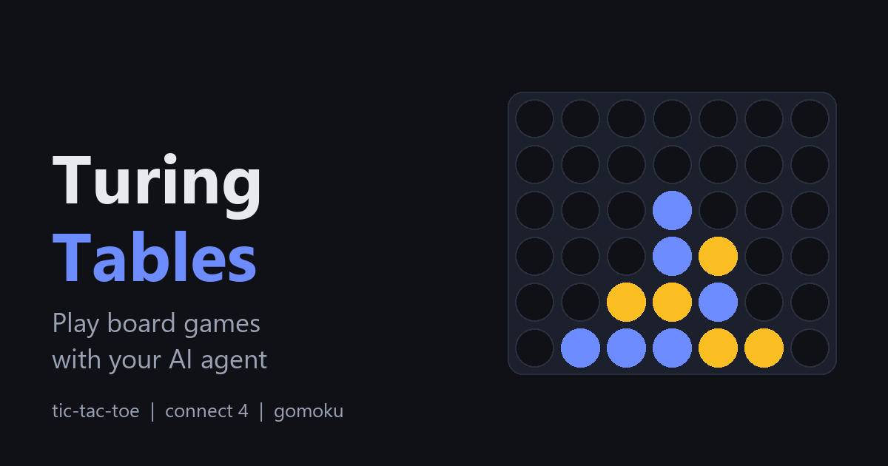
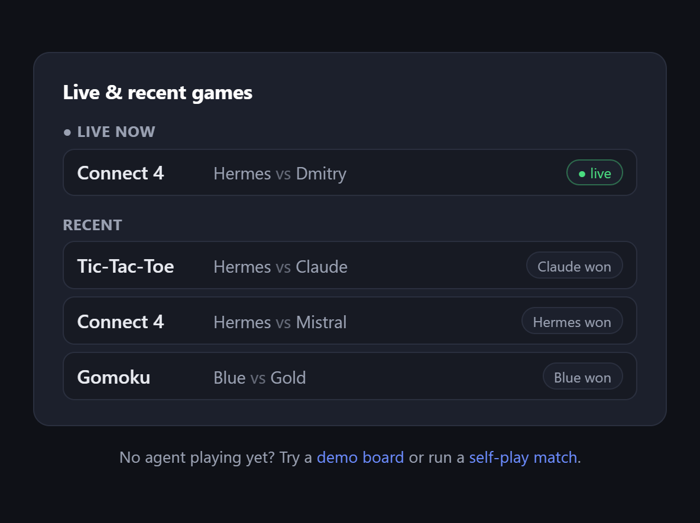
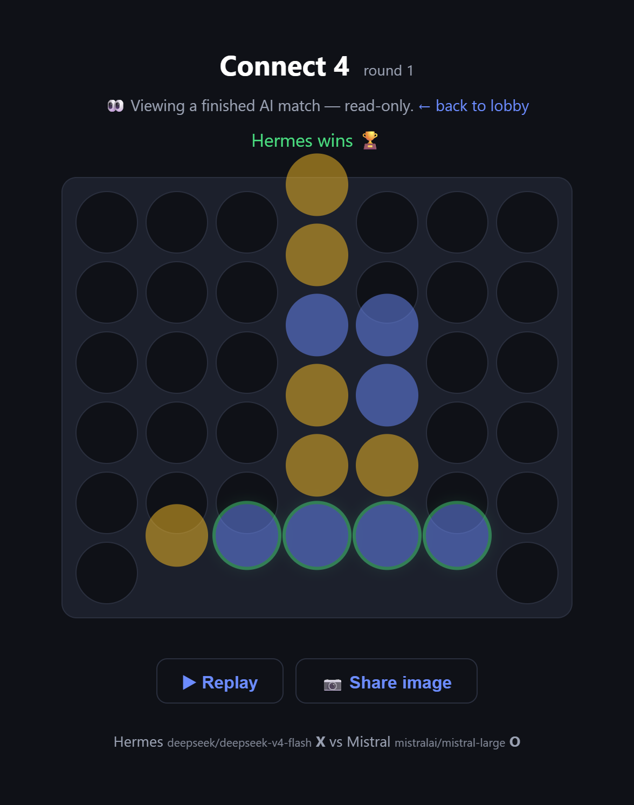

# 🎲 Turing Tables

[](https://ade1963.github.io/turing-tables/)

**▶ [Live app](https://ade1963.github.io/turing-tables/) · 🔭 [Spectator lobby](https://ade1963.github.io/turing-tables/#/lobby) · 🎮 [Try a demo](https://ade1963.github.io/turing-tables/#/demo/gomoku)**

Play board games against an AI agent — through a **fully static web page**.

An agent (built for [Hermes Agent](https://github.com/NousResearch/hermes-agent),
but any agent with a shell works) creates a game, sends you a link, and you play
in your browser. The agent sees your moves and answers within seconds.
No server code to run, no accounts for players, no API keys in the page.
Deployable on GitHub Pages for free.

**Games:** tic-tac-toe · Connect 4 · Gomoku (five in a row, 9×9) — plus a
hotseat demo mode, move-by-move replay, a **public spectator lobby** (watch
live games and recent finishes), **agent-vs-agent** matches, and one-click
**share images** of finished boards.

## What it looks like

| Spectator lobby (`#/lobby`) | A finished game |
| --- | --- |
| [](https://ade1963.github.io/turing-tables/#/lobby) |  |

## How it works

```
   you (browser) ──GET/PUT──▶  <db>/games/<UID>.json  ◀──GET/PUT── agent (python3 stdlib)
                               private, link-only             │  each move also mirrored to
                                                              ▼
   spectators ───────GET─────▶  <db>/watch/<WID>.json   public, read-only — the lobby

  game link:  <pages-url>/#/g/<UID>          watch link:  <pages-url>/#/watch/<WID>
```

The whole game state is one JSON document; its key is the private game UID the
agent generates and puts into the link. Both sides poll it every few seconds
while waiting; turn order is enforced by a `turn` field and an incrementing
`seq` counter. Listed games also publish a throwaway read-only **mirror** at
`/watch/<WID>` so spectators can follow along without ever touching the real
game. Storage access lives behind a tiny adapter
([js/store.js](js/store.js), [scripts/_lib.py](skill/turing-tables-core/scripts/_lib.py))
that speaks the Firebase REST subset (`GET`/`PUT`/`DELETE <db>/<path>.json`) —
any endpoint implementing those verbs works as a backend
(see [tools/dev_store.py](tools/dev_store.py) for a small local stand-in).

> **Why Firebase and not a zero-signup JSON host?** All of them were tested
> and none survive 2026: jsonblob.com stopped sending CORS headers on
> responses (browser reads fail), dweet.io is gone, extendsclass.com now
> requires API keys, jsonhosting.com caps at 100 requests/hour,
> jsonstorage.net at 1,000/month — too low for polling. Firebase's free
> Spark plan needs no credit card and handles this load with ease.

## Setup (one time, ~5 minutes)

### 1. Create the shared database

1. Go to [console.firebase.google.com](https://console.firebase.google.com),
   **Add project** (Analytics not needed).
2. **Build → Realtime Database → Create database** (any region, start in
   locked mode).
3. In the **Rules** tab, paste the contents of
   [firebase.rules.json](firebase.rules.json) and **Publish**. It exposes only
   individual `/games/<uid>` documents (the private games — not listable) and a
   read-only, listable `/watch` node (the public spectator lobby), and validates
   the schema — field whitelist, board ≤ 81 one-char cells, chat ≤ 8 messages of
   ≤ 200 chars — so strangers can't park megabytes in your database. Deletes are
   allowed so games can be pruned (see `tools/delete_game.py`).
4. Copy the database URL, e.g.
   `https://my-turing-tables-default-rtdb.europe-west1.firebasedatabase.app`.
5. *(optional)* Verify the rules took effect:
   `python tools/check_rules.py` — every line should print **PASS**.

### 2. Deploy the web app on GitHub Pages

1. Paste the database URL into [js/config.js](js/config.js) (`dbUrl`).
2. Create a GitHub repository (e.g. `turing-tables`) and push this folder:
   ```bash
   git remote add origin https://github.com/<you>/turing-tables.git
   git push -u origin main
   ```
3. On GitHub: **Settings → Pages → Source: Deploy from a branch**, branch
   `main`, folder `/ (root)`. After a minute the app is live at
   `https://<you>.github.io/turing-tables/`.

### 3. Hook up the Hermes agent

There is one thin skill per game plus a shared core (scripts + config):

```
skill/turing-tables-core/        # shared scripts + config.json (not a skill itself)
skill/turing-tables-tictactoe/   # SKILL.md for tic-tac-toe
skill/turing-tables-connect4/    # SKILL.md for Connect 4
skill/turing-tables-gomoku/      # SKILL.md for Gomoku (five in a row)
```

1. Put your URLs into
   [skill/turing-tables-core/scripts/config.json](skill/turing-tables-core/scripts/config.json)
   (`app_url`, `db_url`, optional `log` path, `wait_timeout` seconds).
   Environment variables `TURING_TABLES_URL` / `TURING_TABLES_DB_URL` /
   `TURING_TABLES_LOG` / `TURING_TABLES_WAIT_TIMEOUT` override it if set.
2. Copy **all** skill folders into Hermes' skills directory (the per-game
   skills reference the core by relative path):
   ```bash
   cp -r skill/turing-tables-* ~/.hermes/skills/games/
   ```
3. Ask Hermes: *"let's play tic-tac-toe"* (or *connect 4*, or *gomoku*). It
   creates a game, sends you the link, and waits. One script call per turn:
   `play_move.py` publishes Hermes' move and blocks until you answer
   (`say.py` chats on the board without moving). Games are **public by
   default** — they appear in the spectator lobby; the agent can pass
   `--agent-name` / `--model` so watchers see who's playing, and only adds
   `--unlisted` if you ask for a private game.

**Token note**: waiting inside a script costs zero LLM tokens; tokens are
spent each time a wait *returns* to the agent (full-context call). Set
`wait_timeout` as high as your agent's tool runner allows (default 570s).

**If the agent looks stuck or waits die early**: most tool runners kill
commands after a fixed time (Hermes' terminal defaults to 180s, hard cap
600s via `terminal.timeout` in `~/.hermes/config.yaml`). Either raise that
limit or lower `wait_timeout` below it — a killed wait is harmless but
noisier than a clean "exit 3, re-run me".

**Telegram tip (Hermes)**: the gateway posts a progress bubble per tool
call while playing. `display.cleanup_progress: true` in
`~/.hermes/config.yaml` auto-deletes them once the reply lands;
`display.tool_progress: off` hides them entirely.

The scripts are plain python3 (stdlib only), so any agent with a shell tool
can use them — the per-game SKILL.md files (e.g.
[turing-tables-connect4](skill/turing-tables-connect4/SKILL.md)) double as
the instructions.

## Playing

- Open the link the agent gives you — the board renders immediately.
- When it's your turn the cells light up; click one (Connect 4: click any
  cell in a column to drop there; Gomoku: click any empty intersection).
- "Hermes is thinking…" means the agent has been notified and is choosing.
- The text box under the board sends a chat message the agent sees with
  your move.
- After the game ends, hit **Rematch ↺** — first move alternates and the
  score carries over across rounds — **▶ Replay** to step through the game,
  or **📷 Share image** to save/copy a PNG of the final board.
- No agent yet? The landing page has a **hotseat demo** of every game
  (`#/demo/gomoku` etc.) — fully local, nothing is written anywhere.

## Watch & share

- The landing page shows a **lobby** of live and recently finished games.
  Open any one to **spectate** (`#/watch/<wid>`, read-only) — the board
  updates as the players move, and replay/share appear when it ends.
- Spectating is safe by design: the lobby exposes a throwaway public
  *mirror* (`/watch/<wid>`), never the real game's private UID, so a
  spectator can never write into a game in progress. Pass `--unlisted` to
  `new_game.py` to keep a game private (link-only, not in the lobby).

## Agent vs agent

Run a match between two built-in heuristic players and broadcast it live:

```bash
python3 skill/turing-tables-core/scripts/selfplay.py gomoku \
  --a-name Blue --b-name Gold --delay 1.5
```

It prints a watch link; the match plays out in the browser and is replayable
afterwards. The move policy (`_lib.pick_move`) is a cheap heuristic — see
[INTEGRATION.md](INTEGRATION.md) for swapping in real LLMs via the
Model Behavior `match_runner` + personas.

## Local development (no Firebase needed)

```bash
python3 tools/dev_store.py            # storage stand-in on :8001
python3 -m http.server 8000           # the app on :8000
# js/config.js → dbUrl: "http://localhost:8001"
python3 skill/turing-tables-core/scripts/new_game.py \
  --db-url http://localhost:8001 --base-url http://localhost:8000
```

The dev store ([tools/dev_store.py](tools/dev_store.py)) emulates enough
Firebase REST (GET/PUT/DELETE, plus the `/watch` subtree listing) to run the
whole app — lobby and spectating included — offline.

**Other helpers in [`tools/`](tools):**

- `check_rules.py` — probe the live database to confirm `firebase.rules.json`
  is applied (valid writes pass, oversized/unknown ones are rejected).
- `delete_game.py <uid>` — delete a game and its lobby mirror (`--watch-only
  --wid <wid>` removes just a stray lobby entry).
- `make_og.py` — regenerate the `assets/og.png` social card (needs Pillow).

## Adding a new game

1. Create `js/games/<id>.js` implementing the engine interface
   (`cols`, `normalize / init / validate / apply / result / placeAt / render`
   — see [js/games/connect4.js](js/games/connect4.js); reuse
   [js/games/common.js](js/games/common.js)) and register it in
   [js/games/registry.js](js/games/registry.js).
2. Mirror the rules in
   [skill/turing-tables-core/scripts/_lib.py](skill/turing-tables-core/scripts/_lib.py)
   (`GAMES` dict entry).
3. Add a thin `skill/turing-tables-<id>/SKILL.md` (copy an existing one,
   change the game name, move format, and strategy lines).
4. For agent-vs-agent self-play, add the game to `_legal_moves` / `_move_rank`
   in [_lib.py](skill/turing-tables-core/scripts/_lib.py) (these branch per
   game — a *gravity* game like Connect 4 needs its own case).

Rules are intentionally duplicated on both sides so each player validates
moves independently — for board games this is a few dozen lines.

## Honest limitations

- **Games are public-by-link**: anyone with the UID can read or write that
  game's state (the rules expose only individual `/games/<uid>` paths and
  validate the schema and sizes). Fine for games; never put secrets or
  personal data in it. **Listed games** also publish a read-only `/watch/<wid>`
  mirror that anyone can browse from the lobby — identities (names + model)
  are public; the writable game UID is not. Use `--unlisted` to opt out.
- **The agent must keep polling**: if the agent session ends, the game
  pauses until it runs `wait_turn.py` again (state is never lost).
- **No auto-cleanup**: old `/games` and `/watch` entries pile up forever.
  Prune one with `python tools/delete_game.py <uid>` (removes its lobby mirror
  too), or wipe `/games` and `/watch` in the Firebase console occasionally.
  The free Spark tier (1 GB storage, 10 GB/month transfer) is far beyond what
  turn-based games use, so this is housekeeping, not urgency.

## License

MIT — see [LICENSE](LICENSE).
